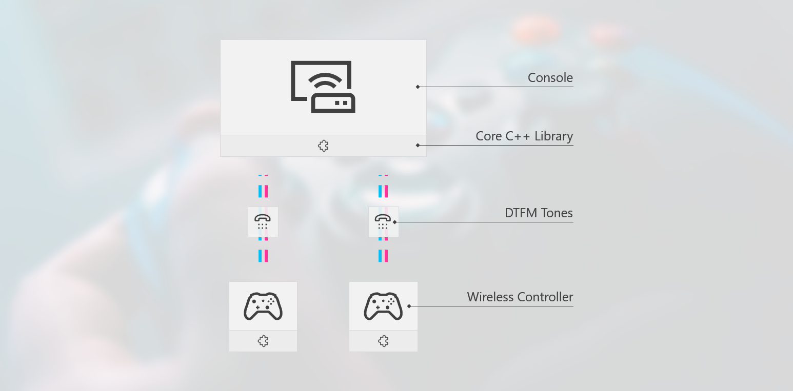

# DTMF Gaming Console System
A gaming platform using DTMF communication between nodes.



## Solution Architecture
There are two projects in this solution:
- [dtmf-lib](dtmf-lib/README.md); a library for DTMF-based node communication.
- [console-app](console-app/README.md); an implementation of the library for user and device interaction.

## UML Diagram


## Directory Structure
The following directory structure is used within a project folder:

```
project
├── bin			: for all executables (applications)
├── obj			: build intermediates
├── lib			: for included libraries
├── include		: for external/API header files
├── src			: for source files
|   ├── namespace/class
└── doc			: for documentation
```

## Naming Conventions
The following conventions are used within the solution's code:

```
Constants		: SOME_CONSTANT
Classes / Namepspace	: someClass
Structures		: someStructure
Methods			: someMethod()
Member Methods		: this->someMethod()
Variables		: someVariable
Member Variables	: this->someVariable
```
